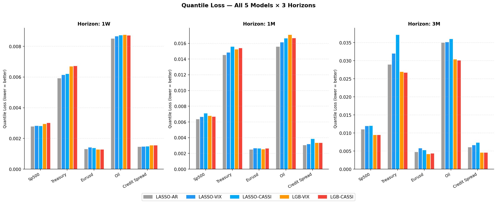
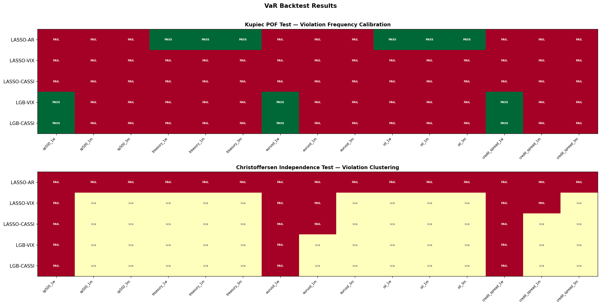
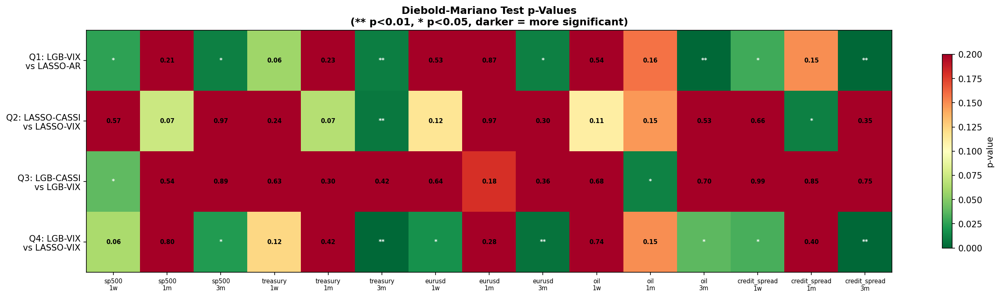
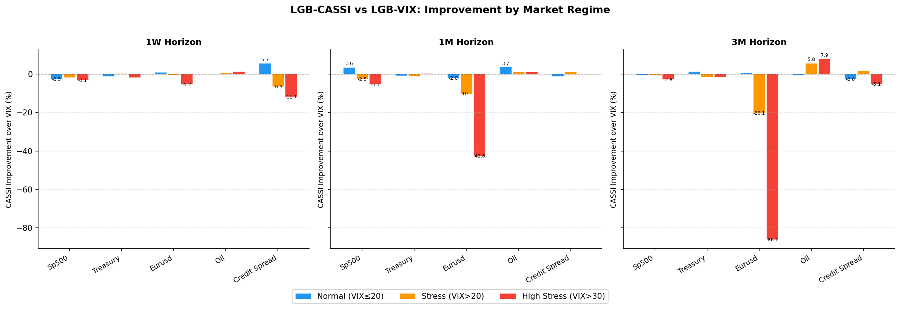
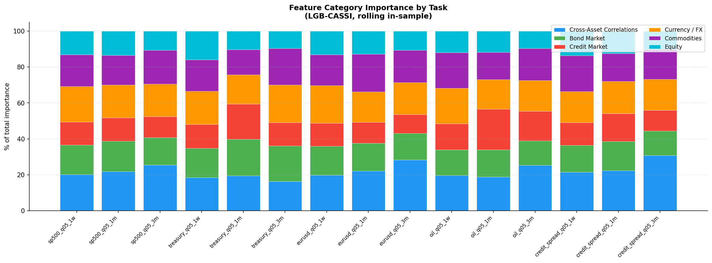
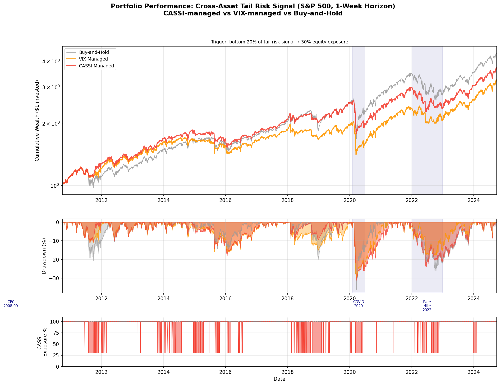

# CASSI: Cross-Asset Stress Signal for Tail-Risk Forecasting

CASSI — Cross-Asset Systemic Stress Indicator: Quantile Tail-Risk Forecasting & VaR Backtesting

I built this to answer a specific question: if you construct a cross-asset stress signal from correlation, volatility, and macro data, does it actually forecast tail risk (VaR) better than just using VIX? Most projects like this stop at "here's my model's accuracy." I wanted to know if the improvement was real or just noise, so I ran it through the same statistical tests used to validate VaR models in practice.

Short answer: mostly no. CASSI beats a VIX-only model in a statistically significant way in 2 out of 15 asset/horizon combinations I tested. It does help in some specific places (treasuries especially), and it exposed a more interesting problem along the way — most of these models, including mine, look fine on average violation rates but fail badly when you test whether violations cluster in time. That second part turned out to be the more useful finding.

## Why this project

Market stress rarely stays in one asset class. It moves through equities, rates, credit, commodities, and FX together. VIX captures expected equity volatility but not that cross-market propagation. CASSI tests whether those cross-market relationships add anything VIX doesn't already have.

## Research questions

1. Does CASSI improve VaR forecasts beyond VIX? — **Rarely, and only in specific cases.** 
2. Do nonlinear models (LightGBM) beat linear ones (LASSO)? — **Not consistently.** Most models land in the same 90% Model Confidence Set.
3. Are any improvements statistically significant, or just noise? — Tested directly with Diebold-Mariano; answered per asset/horizon in Results.
4. Does better quantile forecasting translate into a better portfolio outcome? — **Sometimes.** Strong for treasuries, marginal for S&P 500, mixed elsewhere. See Portfolio Experiment.

## Dataset

Daily data, 2005–2024 (~3,371 trading days).

| Asset | Role |
|---|---|
| S&P 500 | Equity market |
| 10Y Treasury | Rates / safe haven |
| EUR/USD | Currency |
| Crude oil | Commodity |
| HYG (ETF) | Credit spread proxy |
| VIX | Baseline, used for comparison |
| Gold, copper, DXY, JPY/USD | Supporting CASSI features |

## Methodology


```
Raw market data
      │
Data collection & cleaning
      │
Feature engineering
 ├── Own-asset features (shared across all models)
 ├── VIX-derived features
 └── CASSI cross-asset features (no VIX)
      │
Quantile forecasting models (AR, LASSO, HAR, LightGBM)
      │
Statistical validation (DM, Kupiec, Christoffersen, MCS)
      │
SHAP attribution + portfolio overlay
```


## Feature engineering

- Lagged returns, rolling volatility, momentum, rolling skewness/kurtosis (own-asset)
- Cross-asset rolling correlations and volatility spillovers (CASSI)
- VIX-derived features (kept separate from CASSI so the two can be compared head-to-head)

## Models

| Model | Role |
|---|---|
| AR | Simple baseline |
| LASSO | Sparse linear benchmark |
| HAR | Standard realized-volatility benchmark |
| LightGBM | Main nonlinear quantile model |


Each of LASSO and LightGBM is run twice per asset once with VIX features, once with CASSI featuresfor direct comparison

## Evaluation framework

Accuracy alone doesn't tell you if a VaR model is usable, so this goes further:

 **Pinball loss** — primary accuracy metric
- **Diebold-Mariano** — is a loss difference statistically real?
- **Kupiec POF** — does the violation rate match the target 5%?
- **Christoffersen independence** — are violations clustered in time?
- **Model Confidence Set (90%)** — which models can't be ruled out?
- **Regime split** (VIX <20 / 20–30 / >30) — does CASSI's edge show up specifically during stress?

## Results

**CASSI vs. VIX.** Ahead on raw quantile loss in about half of 15 asset/horizon pairs, but significant in only 2 (oil, 1-month horizon).



**Calibration breaks down at longer horizons.** Most models pass Kupiec at 1-week, but fail by 1–3 months, with violation rates up to 11% against a 5% target. Christoffersen fails for nearly every model at every horizon — violations cluster instead of scattering randomly. This matters more than the headline accuracy numbers: a model can pass the average-rate check and still fail exactly when it counts.




**Model Confidence Set.** Most models are statistically indistinguishable from each other. LightGBM only separates from LASSO at the 1-week horizon for S&P 500 and treasuries.

**By regime.** CASSI's name implies it should shine during stress. It doesn't — only 3 of 45 regime/asset/horizon cells show a significant edge, and they're not concentrated in high-stress periods.



**What drives CASSI.** Cross-asset correlation features are the largest SHAP contributor across nearly every asset and horizon (18–31% of importance).



## Portfolio experiment

Simple volatility-managed overlay vs. buy-and-hold and a VIX-managed version.

| Asset | Strategy | Sharpe | Max Drawdown |
|---|---|---|---|
| S&P 500 | Buy-and-Hold | 0.494 | -36.1% |
| S&P 500 | CASSI-Managed | 0.488 | -31.2% |
| Treasury | Buy-and-Hold | -0.027 | -94.3% |
| Treasury | CASSI-Managed | 0.086 | -80.9% |

Small, real drawdown reduction on S&P 500; a clear win on treasuries; mixed elsewhere. During the 2020 crash and 2022 rate-hike selloff, both managed strategies underperformed buy-and-hold — vol-targeting de-risks after the spike, missing part of the recovery. A known limitation of the strategy class, not specific to CASSI.




## Repository structure


cassi-tail-risk/
├── data_collection.py         # pulls raw price/rate data
├── data_cleaning.py           # cleans and aligns everything
├── feature_engineering.py     # builds CASSI + own-asset features
├── model_training.py          # AR / LASSO / LightGBM quantile models
├── har_benchmark.py           # HAR-RV comparison
├── evaluation.py              # Kupiec, Christoffersen, DM, MCS tests
├── crisis_clustering.py       # regime-split analysis
├── shap_analysis.py           # feature attribution
├── portfolio_experiment.py    # vol-managed portfolio backtest
├── visualization.py           # generates the figures
├── results/
│   ├── figures/
│   └── tables/
└── requirements.txt


## Limitations

- HYG proxies credit spreads instead of the cleaner FRED BAML OAS series (free API only gives 3 years of history) — adds noise to credit-spread results specifically.
- Calibration fails past the 1-week horizon; don't trust these models for real VaR reporting at 1m/3m without a GARCH or regime-switching term.
- Portfolio backtest is a single historical path, not walk-forward validated — illustrative, not a tested trading strategy.

## Next steps

- Add a volatility-clustering term to fix the Christoffersen failures.
- Try a combined VIX + CASSI model instead of treating them as competitors.
- Source a longer, cleaner credit spread series.
- Walk-forward re-test the portfolio overlay with transaction costs.

## Running it

```bash
pip install -r requirements.txt
python data_collection.py
python data_cleaning.py
python feature_engineering.py
python model_training.py
python har_benchmark.py
python evaluation.py
python crisis_clustering.py
python shap_analysis.py
python portfolio_experiment.py
python visualization.py
```

## Built with

Python, LightGBM, scikit-learn, SHAP, pandas, NumPy, SciPy, Matplotlib.